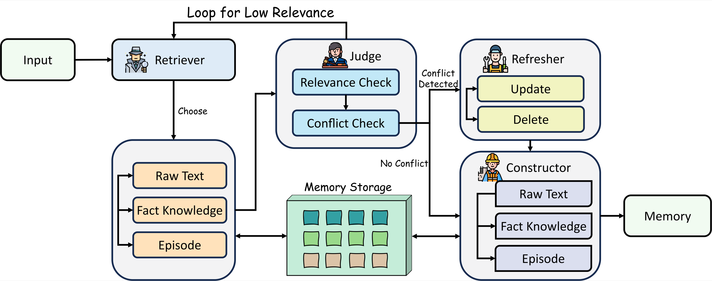

# AMA: Adaptive Memory via Multi-Agent Collaboration

<p align="center">
  <a href="https://aclanthology.org/2026.findings-acl.152/"></a>
  <a href="https://arxiv.org/abs/2601.20352"></a>
  <a href="https://huggingface.co/papers/2601.20352"></a>
  <a href="https://sherlockwz.github.io/AMA/"></a>
  <a href="https://github.com/Sherlockwz/AMA/actions/workflows/ci.yml"></a>
  <a href="LICENSE"></a>
</p>

<p align="center">
  Official code and reusable memory skills for <strong>AMA</strong> (Findings of ACL 2026).
</p>

<p align="center">
  <a href="README_zh-CN.md">中文说明</a> ·
  <a href="docs/reproduction.md">Reproduction</a> ·
  <a href="docs/architecture.md">Architecture</a> ·
  <a href="docs/openclaw.md">OpenClaw adapter</a>
</p>

## News

- **2026-08-22:** We released the AMA research code, project page, and reusable memory skill with an OpenClaw reference adapter.

## Table of contents

- [Overview](#overview)
- [How AMA works](#how-ama-works)
- [Two ways to use this repository](#two-ways-to-use-this-repository)
- [Headline results](#headline-results)
- [Repository layout](#repository-layout)
- [Setup](#setup)
- [Research code](#research-code)
- [Memory skill for Harness Agents](#memory-skill-for-harness-agents)
- [Citation](#citation)

## Overview

Long-term agent memory is more than storing and retrieving old messages. Different questions require different levels of detail, and user information can change over time. A useful memory system must therefore select the right representation, verify whether retrieved evidence is sufficient, and repair outdated knowledge instead of continually accumulating contradictions.

AMA addresses this problem through four collaborating agents and three complementary memory granularities:



| Agent | Responsibility |
| --- | --- |
| **Constructor** | Builds traceable raw-text memory, atomic fact knowledge, and event-level episode memory. |
| **Retriever** | Rewrites the current query and routes it to the memory granularity that best matches its intent. |
| **Judge** | Checks relevance and logical consistency, and requests another bounded retrieval round when evidence is insufficient. |
| **Refresher** | Updates or removes conflicting memories so that stored knowledge follows the latest valid user state. |

| Memory form | What it preserves | Best suited for |
| --- | --- | --- |
| **Raw Text** | Exact wording, conversational traces, and fine-grained temporal details | Questions requiring precise evidence |
| **Fact Knowledge** | Atomic and reusable information extracted from dialogue | Direct factual recall and user attributes |
| **Episode Memory** | Events and abstractions synthesized across multiple turns | Summaries and higher-level reasoning |

## How AMA works

For each incoming turn, AMA executes a coordinated memory lifecycle:

1. **Retrieve:** rewrite the query, infer its information need, and search the appropriate memory granularity.
2. **Judge:** filter irrelevant evidence and decide whether to pass, retry retrieval, or refresh conflicting memory.
3. **Refresh:** update stale information or delete it only when the user explicitly asks to forget it or a conflicting record has expired.
4. **Construct:** preserve the validated interaction as raw text, fact knowledge, and—when appropriate—an episode.

This loop separates memory construction, retrieval, verification, and maintenance into explicit roles while keeping the number of retrieval rounds bounded.

## Two ways to use this repository

| Path | When to use it | Start here |
| --- | --- | --- |
| **Research reference implementation** | Study AMA, inspect the original Python pipeline, or reproduce the LoCoMo and LongMemEval`_s` experiments | [`python/AdaptiveMemory`](python/AdaptiveMemory), [reproduction guide](docs/reproduction.md) |
| **Harness Agent memory skill** | Add AMA-style long-term memory behavior to an agent harness; use the included OpenClaw plugin as a complete reference adapter | [`SKILL.md`](SKILL.md), [architecture guide](docs/architecture.md), [OpenClaw adapter](docs/openclaw.md) |

## Headline results

| Evaluation | AMA | Reference point |
| --- | ---: | ---: |
| LoCoMo overall LLM Score (GPT-4o-mini) | **0.774** | Nemori 0.740; FullContext 0.717 |
| LongMemEval`_s` average accuracy | **0.698** | Nemori 0.642 |
| LongMemEval`_s` knowledge-update accuracy | **0.897** | AMA without Refresher 0.568 |
| LoCoMo input tokens at `K_r=2` | **3,613** | FullContext 18,625 |

AMA achieves the highest reported overall LoCoMo LLM Score across all four tested backbones. On LongMemEval`_s`, the strongest gains appear in assistant-side recall, multi-session reasoning, knowledge updates, and user-specific information. Temporal reasoning remains a limitation: Nemori outperforms AMA in that category. See the [project page](https://sherlockwz.github.io/AMA/) for the complete result tables, efficiency analysis, retrieval-round study, ablations, and case study.

## Repository layout

```text
AMA/
├── python/AdaptiveMemory/   # paper reference implementation and evaluation code
├── python/server.py         # local AMA HTTP sidecar
├── backend/                 # runtime ↔ sidecar adapter
├── tools/                   # six agent-callable AMA memory operations
├── skills/ama-memory/       # distributable memory skill
├── docs/                    # project page and technical guides
├── tests/                   # TypeScript and Python tests
├── index.ts                 # OpenClaw reference-adapter entry point
├── openclaw.plugin.json     # OpenClaw plugin manifest
└── SKILL.md                 # portable agent operating policy
```

## Setup

### Requirements

- Python 3.10+
- Node.js 22.22.3+ (Node.js 24.15+ is also supported)
- pnpm 11+
- an OpenAI-compatible chat-completions endpoint and embedding endpoint

```bash
git clone https://github.com/Sherlockwz/AMA.git
cd AMA
corepack enable pnpm
./scripts/setup.sh
```

Configure credentials in your shell. Do not commit API keys.

```bash
export AMA_LLM_API_KEY="your-api-key"
export AMA_LLM_BASE_URL="https://api.openai.com/v1/chat/completions"
export AMA_EMBEDDING_URL="https://api.openai.com/v1/embeddings"
```

The implementation accepts providers exposing compatible chat-completions and embeddings APIs. Copy [`.env.example`](.env.example) when you need a local template.

## Research code

The original Python implementation lives in [`python/AdaptiveMemory`](python/AdaptiveMemory). Evaluation entry points are under [`python/AdaptiveMemory/Core`](python/AdaptiveMemory/Core). Benchmark datasets are not redistributed; follow the [reproduction guide](docs/reproduction.md) to obtain and place them.

Run the local sidecar for a direct smoke test:

```bash
.venv/bin/python -m uvicorn python.server:app --host 127.0.0.1 --port 8321
curl http://127.0.0.1:8321/health
```

## Memory skill for Harness Agents

[`SKILL.md`](SKILL.md) expresses AMA as a portable operating policy for agent-harness architectures. It describes when an agent should retrieve prior context, capture user and assistant turns, synthesize episodes, inspect state, and honor explicit deletion requests. A harness can load this policy and bind the six AMA operations through its own tool interface.

The repository also includes a complete **OpenClaw reference adapter** with automatic recall/capture hooks, CLI commands, and a managed SQLite/FAISS sidecar:

```bash
openclaw plugins install --link .
openclaw plugins enable openclaw-ama
openclaw ama doctor
```

<details>
<summary><strong>Minimal OpenClaw configuration</strong></summary>

```json5
{
  plugins: {
    slots: { memory: "openclaw-ama" },
    allow: ["openclaw-ama"],
    entries: {
      "openclaw-ama": {
        enabled: true,
        hooks: { allowConversationAccess: true },
        config: {
          llmApiKey: "${AMA_LLM_API_KEY}",
          llmBaseUrl: "${AMA_LLM_BASE_URL}",
          embeddingApiUrl: "${AMA_EMBEDDING_URL}",
          dataDir: "./ama-data",
          sidecarAutoStart: true,
          autoRecall: true,
          autoCapture: true
        }
      }
    }
  }
}
```

</details>

See the [OpenClaw adapter guide](docs/openclaw.md) for Git installation, configuration options, tool definitions, permissions, and troubleshooting.

## Validation

```bash
./scripts/check.sh
```

This runs strict TypeScript checks, Vitest, Python unit tests, bytecode compilation, and the production bundle.

## Citation

If AMA helps your work, please cite:

```bibtex
@inproceedings{huang-etal-2026-ama,
  title     = {{AMA}: Adaptive Memory via Multi-Agent Collaboration},
  author    = {Huang, Weiquan and Wang, Zixuan and Lin, Hehai and Wang, Sudong and Xu, Bo and Li, Qian and Zhu, Beier and Yang, Linyi and Qin, Chengwei},
  booktitle = {Findings of the Association for Computational Linguistics: ACL 2026},
  year      = {2026},
  pages     = {3099--3120},
  doi       = {10.18653/v1/2026.findings-acl.152},
  url       = {https://aclanthology.org/2026.findings-acl.152/}
}
```

Machine-readable citation files are available as [`CITATION.cff`](CITATION.cff) and [`CITATION.bib`](CITATION.bib).

## Contributing

Bug reports, reproducibility notes, documentation improvements, and integrations are welcome. Please read [`CONTRIBUTING.md`](CONTRIBUTING.md) and use the issue templates.

## License

Released under the [Apache License 2.0](LICENSE).
