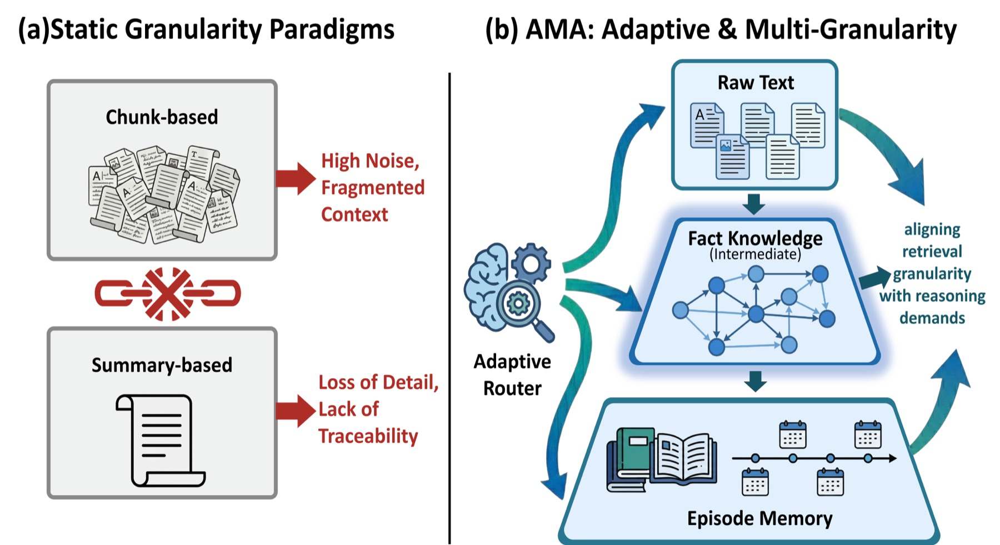
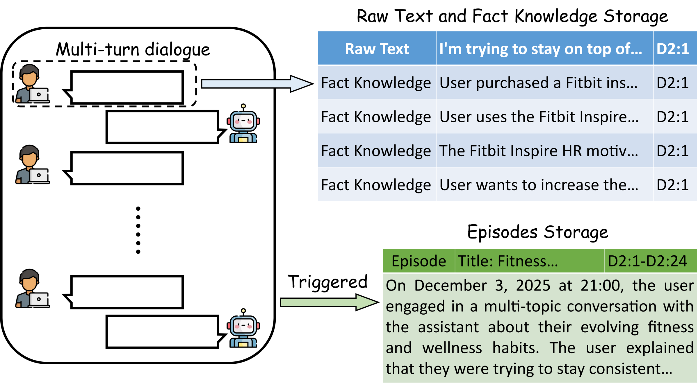

# AMA architecture

AMA separates long-term memory into three representations and coordinates four role-specialized agents across the memory lifecycle.


## Memory representations

| Representation | Best suited to | Stored form |
| --- | --- | --- |
| Raw Text Memory | exact phrasing, temporal details, and traceability | original conversational turns plus metadata |
| Fact Knowledge Memory | stable facts and precise lookup | atomic subject–verb–object/complement facts |
| Episode Memory | events, topics, and cross-turn abstraction | synthesized session or topic summaries |



## Collaborative pipeline

1. **Retriever** rewrites the current query into a self-contained form, predicts retrieval intent, and chooses the appropriate granularity.
2. **Judge** verifies whether the retrieved evidence is relevant and sufficient. If not, it requests another bounded retrieval round. It also identifies contradictions between new input and stored facts.
3. **Refresher** resolves detected conflicts through a targeted update or deletion rather than allowing stale knowledge to accumulate.
4. **Constructor** converts validated conversational content into raw-text records and structured fact knowledge. Topic shifts, explicit requests, or context saturation can trigger episode synthesis.



## OpenClaw integration

```text
OpenClaw gateway
  ├─ before_prompt_build hook ──► AMA retrieval ──► <ama-memories>
  ├─ agent_end hook ────────────► capture user/assistant turns
  ├─ six AMA tools ─────────────► explicit memory operations
  └─ openclaw ama CLI ──────────► diagnostics and maintenance
                                      │
                                      ▼
                              Python sidecar :8321
                               ├─ AMA agents / prompts
                               ├─ SQLite metadata
                               └─ FAISS vector indices
```

The TypeScript plugin is responsible for OpenClaw lifecycle integration, configuration, tool contracts, and sidecar process management. The Python service retains the research implementation and owns memory persistence. Communication is local HTTP over `127.0.0.1`; the default port is `8321`.

## Persistence and identity

The `userId` configuration selects an isolated logical memory namespace. AMA normalizes that identifier before using it for SQLite table names. Runtime data is written beneath `dataDir` (`./ama-data` by default) and is intentionally ignored by Git.

The current implementation stores:

- dialogue, fact, episode, and sentence records in SQLite;
- semantic indices in FAISS;
- short-term working context in the sidecar process.

## Design implications

- Retrieval granularity is selected per query instead of forcing every question through one representation.
- The Judge turns retrieval into a feedback loop while keeping it bounded through `turnRetrieve`.
- Conflict handling is part of memory maintenance, not a post-processing cleanup step.
- The OpenClaw adapter keeps provider credentials and user-specific runtime data outside the repository.

For the full algorithm, prompts, and evaluation, see the [ACL paper](https://aclanthology.org/2026.findings-acl.152/).
