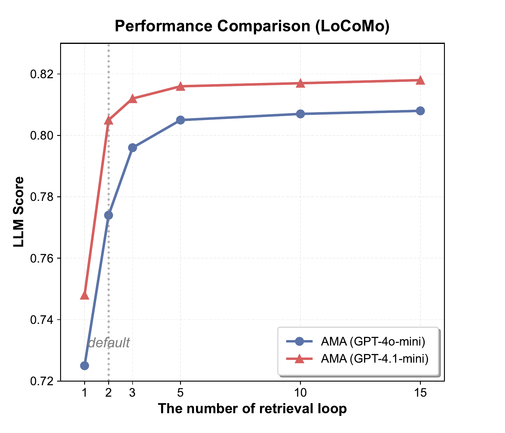
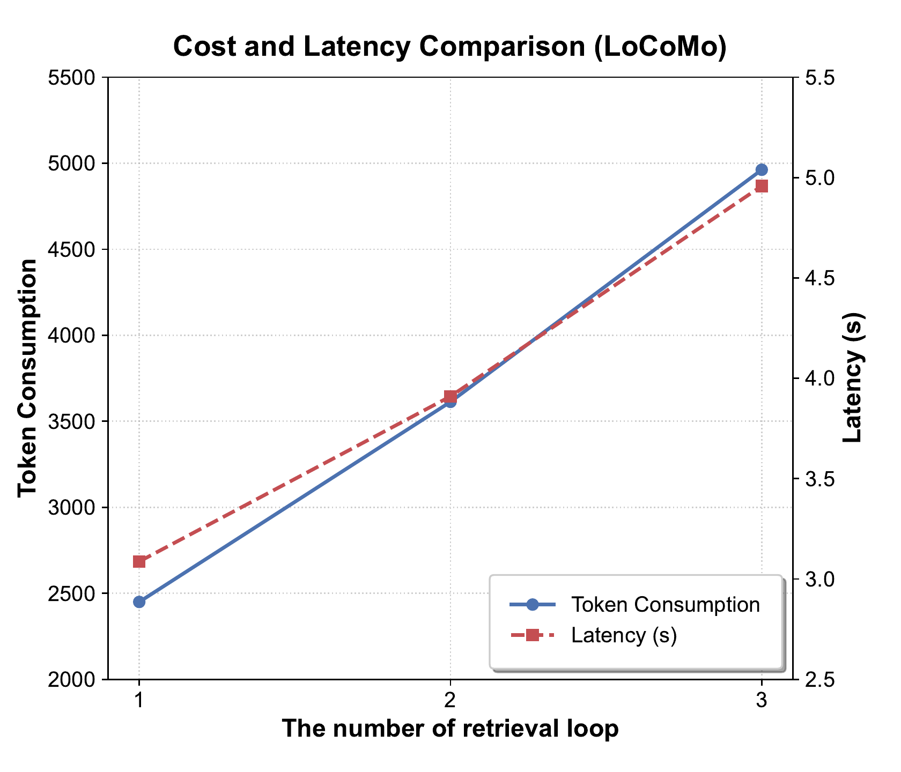

# Reproducing AMA experiments

This repository preserves the AMA implementation and LoCoMo processing/evaluation entry points. Benchmark datasets and model API responses are not redistributed. Exact aggregate numbers can vary with provider-side model revisions, latency, and API nondeterminism.

## Environment

The paper evaluates AMA on LoCoMo and LongMemEval\(_s\). The released scripts in this repository currently cover the LoCoMo construction, QA, and scoring path.

```bash
git clone https://github.com/Sherlockwz/AMA.git
cd AMA
corepack enable pnpm
./scripts/setup.sh
```

Set an OpenAI-compatible provider:

```bash
export AMA_LLM_API_KEY="your-api-key"
export AMA_LLM_BASE_URL="https://api.openai.com/v1/chat/completions"
export AMA_EMBEDDING_URL="https://api.openai.com/v1/embeddings"
```

The original experiments use 3,072-dimensional embeddings. Keep the embedding dimensionality consistent with the FAISS initialization in [`AMA.py`](../python/AdaptiveMemory/Core/AMA.py).

## Dataset

Obtain LoCoMo from its official distribution and place `locomo10.json` in:

```text
python/AdaptiveMemory/Core/locomo10.json
```

Dataset files are ignored by Git and remain subject to their original license and terms.

## 1. Build memory

The scripts use paths relative to `python/AdaptiveMemory/Core`, so run them from that directory:

```bash
cd python/AdaptiveMemory/Core
../../../.venv/bin/python evalProcess.py --user_id 1
```

Repeat `--user_id` from `1` through `10` for the ten LoCoMo conversations. This stage feeds the sessions into AMA and creates SQLite/FAISS state.

## 2. Generate answers

```bash
../../../.venv/bin/python evalLocomo.py --user_id 1
```

Repeat for IDs `1` through `10`. Per-conversation predictions are written to `outputForLocomo/output_locomo_<id>.json`.

## 3. Score predictions

```bash
../../../.venv/bin/python eval.py
```

This merges the per-conversation outputs and reports token F1, BLEU, and LLM-as-judge statistics. Configure the evaluator's judge endpoint before using the LLM score; F1 and BLEU can be computed locally.

## Reference results

The published paper reports:

| Benchmark / setting | Result |
| --- | ---: |
| LoCoMo, GPT-4o-mini, overall LLM score | 0.774 |
| LoCoMo, GPT-4.1-mini, overall LLM score | 0.805 |
| LongMemEval\(_s\), average accuracy | 0.698 |
| LongMemEval\(_s\), single-session-user | 0.986 |
| LongMemEval\(_s\), knowledge-update | 0.897 |

At \(K_r=2\), AMA uses 3,613 input tokens and 3.91 seconds in the reported LoCoMo efficiency analysis, compared with 18,625 tokens and 7.21 seconds for FullContext.





## Reproducibility checklist

- Record the exact LLM and embedding model identifiers returned by your provider.
- Keep temperature, `turnRetrieve`, `topK`, and embedding dimensionality fixed.
- Use a fresh `Store/` or `dataDir` for each clean run.
- Preserve raw predictions before running aggregate evaluation.
- Report provider, date, hardware, and whether latency includes network time.
- Never commit datasets, API credentials, SQLite files, or FAISS indices.

For methodological details and all ablations, use the [ACL Anthology version](https://aclanthology.org/2026.findings-acl.152/) as the authoritative reference.
